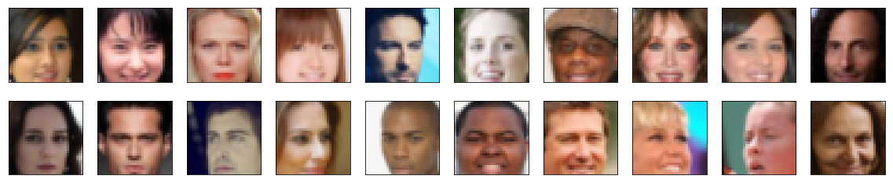
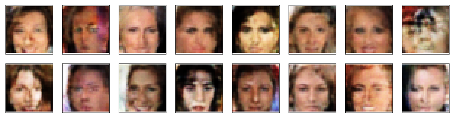

## Face Generation using Generative Adversial Network (Udacity)

### Introduction

 In this project, a DCGAN is defined and trained on a dataset of faces to generate new images of faces that look as realistic as possible.

### DataSet

The [CelebFaces Attributes Dataset (CelebA)](https://s3.amazonaws.com/video.udacity-data.com/topher/2018/November/5be7eb6f_processed-celeba-small/processed-celeba-small.zip) has been used to train the DCGAN.

Udacity already provided cropped images of the 64x64x3 since the project focus was on GANs.

### Image Preprocessing

The images were then converted to a 32x32 size using Image Transforms and converted to a Tensor using a dataloader function. The images were then scaled to a range of -1 to 1 because a tanh active generator will contain pixel values in the range of -1 to 1.

## Model Definition

The GAN network is composed of:
- A Discrimator : The discriminator network is convolution network with normalization and without max pooling layers. The discrimator network learns from the preprocessed dataset passed to it.

My final discriminator network consisted of 3 convolution layers and the feedforward network functions using Leaky_Relu to speed up training since it can assist in the vanishing gradient problem.

- A Generator: The generator network upscales an input and generates an new image. 

My final Generator network is composed of transpose convolution layers and feedforward functions using relu activation.

## Training

The model was consistently trained across various hyper parameters for over a variety of epoch sizes to obtain the most accurate output of images given below.

